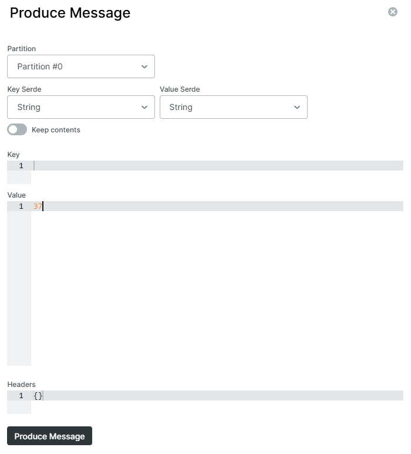

# Kafka Streams Quickstart

This project creates some small Kafka streams processors. Most of the code take from or inspired by the Apache Kafka website.

Before running, start a kafka broker on localhost:9092

- `CreateTopics` - creates the topics needed by these snippets
- `Writer` - sends initial set of messages, using processor API
- `WordCount` - count words in input messages, using streams DSL
- `Pipe` - copy events from one topic to another
- `LineSplit` - split messages into multiple other messages
- `States` - rather contrived example that demonstrates the processor API in combination with stateful processing

```
                    +--------------------------+
                    | streams-wordcount-output |
                    +--------------------------+
                                  ^
                                  |
                             WordCount
                                  ^
                                  |
+--------------+              +-------------------------+            +---------------------+
| writer-input | -> Writer -> | streams-plaintext-input | -> Pipe -> | streams-pipe-output |
+--------------+              +-------------------------+            +---------------------+
                                  |                  |
                                  v                  v
                                States           LineSplit
                                                     |
                                                     v
                                           +--------------------------+
                                           | streams-linesplit-output |
                                           +--------------------------+
```
## Producing messages

The `Writer` process generates a stream of random sentences.
To get the ball(s) rolling, you need to send a message to the `writer-input` topic with a value that indicates how many
random sentences it should send.
One way to do this is using the
[kafka-ui](http://localhost:8080/ui/clusters/local/all-topics/writer-input).

Click 'Produce message', then enter a numerical value where it says 'Value'. The contents of the Key does not matter in this case.
Then finally click 'Produce mesage' at the bottom of the dialog to actually produce the message.


